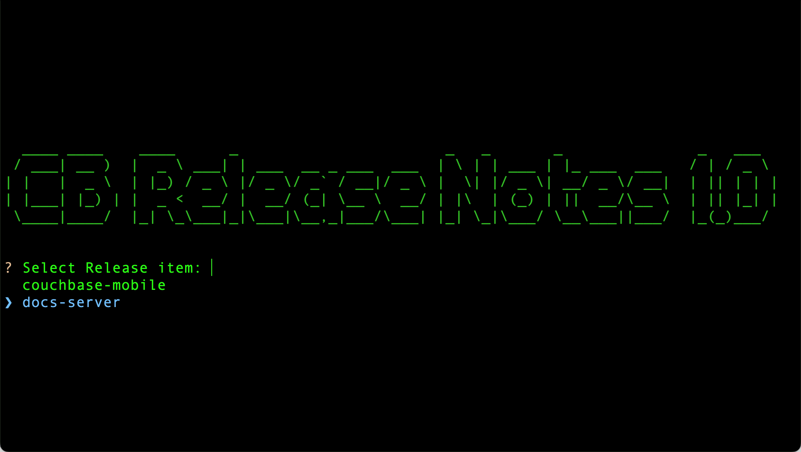
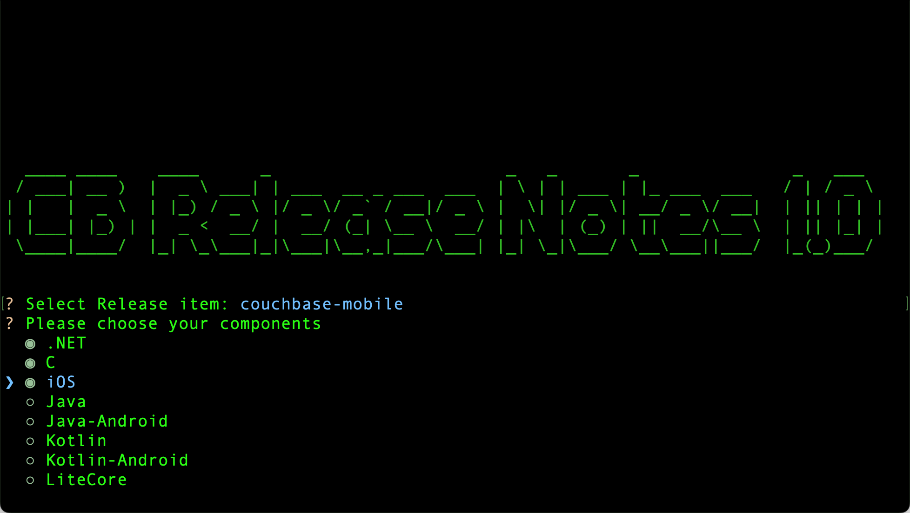

= Couchbase Release Notes Builder

== Introduction

Creating release notes from Jira issues is pretty dull, AmIRight?

Each module's release note is in a different format, and you need a different Jira search to find the ones that go in the notes (and don't forget to filter out the private ones).

[#cb-release-notes-image]
.cb_release_notes is off and running!

Well, the boffins in the docs team have put together a small Python script to take some of the tedium out building release notes.

WARNING: This isn't going to do the whole thing automatically, but we're aiming to cover the dull bits of the process. +
After generating the release notes, make sure you look through them to make sure they are correct!

== Installation

The script and its associated libraries are packaged as single executable.

. Download `package.zip`  from here and unpack it into a spare directory.
. Your directory set up should look something like this:
+
[source, text]
----
📂
  📄 cb_release_notes              <.>
  📄 cb_release_notes_config.yml   <.>
  📂 templates
    📄 couchbase-mobile.jinja2     <.>
    📄 couchbase-docs-server.jinja2
----
<.> The application
<.> The application's configuration file.
<.> A template for generating the Asciidoc release note.
+
NOTE: The location of the templates can be specified in `cb_release_notes_config.yaml`.

== Configuration
Release notes are created from a `release set` specified in the configuration file:

[source, yaml]
----
# Configuration file for the release notes builder
version: "1.0"    <.>

password_file: ./.passwords.yaml    <.>
templates_directory: ./templates    <.>

release_settings:    <.>

  - name: couchbase-mobile
    url: https://issues.couchbase.com    <.>
    jql: project = CBL AND issuetype in ({{issue_types}})    <.>
      AND Status = Closed
      AND Resolution = Fixed
      AND Component in ({{components}})
      AND Level = 'Public'    <.>
      AND fixVersion = {{release_number}}

    fields:    <.>

    - name: components
      type: choice
      message: Please choose your components
      choices:
        - .NET
        - C
        - iOS
        - Java
        - Java-Android
        - Kotlin
        - Kotlin-Android
        - LiteCore

    - name: issue_types
      type: choice
      message: Select issue type
      choices:
        - Bug
        - Improvement
        - "New Feature"
    - name: release_number
      type: text
      message: Enter the release number
    - name: release_date
      type: text
      message: Enter the release date (Month Year)

    template: couchbase-mobile.jinja2    <.>

  - name: docs-server
    url: https://issues.couchbase.com
    jql: project = MB AND issuetype = Bug
         AND status = Closed
         AND resolution = Fixed
         AND fixVersion IN ({{release_number}})
         AND component in (analytics, eventing, fts, ns_server, query, query_tools, rbac, XDCR, memcached)

    fields:

      - name: release_date
        type: text
        message: Enter the release date (Month Year)

      - name: release_number
        type: text
        message: Enter the release number

    template: couchbase-docs-server.jinja2
----
<.> The version of the application.
This is just to help keep track of things.
<.> The location of the passwords file. URLS in the `release-settings` require a username/password or a token for access. These are stored in a separate file that is keyed to the URL:
+
[source, yaml]
----
https://issues.couchbase.com:
  username: fred.smith
  password: fancypants120

https://atlassian.couchbase.com:
  token: HUFGHitha354HHFHAPLKHJ
----
<.> The location of the `Jinja2` templates used to render the release notes.
<.> Marks the beginning of a release set. When the program runs, you will be presented with a list of release sets (see xref:cb-release-notes-image[xrefstyle=short]) to pick from.
<.> The URL for the issue database.
+
IMPORTANT: The URL is used as the key for the password file.Make sure that the entries match up exactly.
<.> The JQL statement used to retrieve the Jiras making up the release note.
You can use macros variables (`+{{variable_name}}+`) inside the JQL, which will need to be filled in when the generator runs.
<.> The 'fields' section is a list of fields that the program will ask for.
The user will fill in the entries, and the value will be stored under the given name (`release_number` for example).
The fields can be referenced in the `jql` statement and/or the `jinja` template.
The program currently supports three field types:
[horizontal]
text:: An arbitrary field of text.
multiline:: The same as text, except you can enter multiple lines.
editor:: This will open your system editor for editing large wodges of text.
+
WARNING: This one is experimental; we recommend you don't use it in production.

select:: A menu selection from which the user can select a single value.
choice:: A multiple choice selection.
+
.Making a multiple selection

<.> A lot of Jiras are not meant for public consumption, so it's a good idea to check that the Jiras included in the release note are marked for public consumption.
<.> The template that will be used to render the release note.
For more information on `Jinja2` templates, see the https://jinja.palletsprojects.com[Jinja Documentation]

NOTE: Every release set should require a release number at the very least.

== Running the program

The program is a Python script packaged as an executable (hence the size!)
Run it from the shell:
[source, shell]
----
./cb_release_note
----

And follow the instructions.

Now copy the generated file to the `partials` directory of the module under release.
Then `include::` the file at the top of the existing release note.

